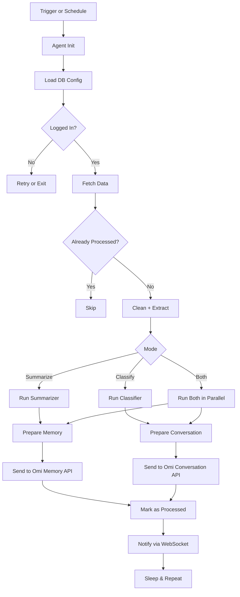

<h1 align="center">🧠 Agent Mate</h1>
<p align="center">
  <b>Modular · Event-Driven · AI-Powered</b><br/>
  <i>Your AI assistant’s operational backbone — scalable, smart, and built for the future.</i>
</p>

<p align="center">
  
  
  
  
</p>
<p align="center">
  
</p>

---

## 🚀 What is Agent Mate?

Agent Mate is a **fully modular**, **asynchronous**, and **LLM-ready** framework that powers AI agents to connect with real-world data sources like Gmail, Notion, Calendars, and more.

> Imagine it as a **brain extension** for your assistant — collecting data, analyzing context, and triggering intelligent behavior.

---

## 🧩 Features At a Glance

- ✅ Natural Language Task Execution  
- ✅ Real-Time Data Fetching from Gmail, Notion, etc.  
- ✅ Agent-Based Architecture with Isolated Lifecycles  
- ✅ Rich Memory + Conversation Output for Omi  
- ✅ Built-in Rate Limiting, Batching, and Retry Systems  
- ✅ WebSocket + REST Integration for Frontend Sync

---

## 🏗️ Architecture Overview

```
AgentMate/
├── Core/             # Configuration, DI, EventBus, Plugins
├── DB/               # PostgreSQL models + services
├── Agents/           # AI agents (Gmail, Notion, etc.)
├── Engines/          # Summarizer, Classifier, etc.
├── Interfaces/       # Contracts for agents, engines
├── Subscribers/      # Event-driven consumers
├── Routers/          # Includes routers Auth, user, webhook etc.
└── main.py           # Entrypoint
```

### 🔧 Core Systems

- **🧩 Plugin Loader** – Register agents/subscribers dynamically  
- **🔁 EventBus** – Async Pub/Sub system using Redis  
- **🧠 AI Engine Layer** – Connect to OpenAI or other LLMs  
- **🧪 Config Validator** – Schema-based service settings  
- **🛑 Error Middleware** – Centralized exception tracking

---

## 🦾 Agents in Action

| Agent             | Status | What it Does                                 |
|------------------|--------|-----------------------------------------------|
| `GmailAgent`      | ✅ Live  | Fetches emails, extracts info, pushes to Omi |
| `NotionAgent`     | 🔜 Soon | Pulls content blocks and page context        |
| `CalendarAgent`   | 🔜 Soon | Parses and extracts upcoming events          |
| `SlackAgent`      | 🔜 Soon | Reads conversations for intent/context       |
| `WebScraperAgent` | 🔜 Soon | Periodically scrapes news or structured data |

---

## 🔄 System Flow Diagram



---

## 📡 API Reference

### 📁 User Settings

| Method | Endpoint | Description |
|--------|----------|-------------|
| `POST` | `/settings/` | Create or update user config |
| `GET`  | `/settings/{uid}/{service}` | Fetch config for a specific user/service |

### 🤖 Agent Control

| Method | Endpoint | Description |
|--------|----------|-------------|
| `GET` | `/agent/status` | List active agents |

### 🔐 Auth System

| Method | Endpoint | Description |
|--------|----------|-------------|
| `GET`  | `/{service}/is-logged-in` | Check login state |
| `POST` | `/{service}/login-directly` | Direct login (token) |
| `POST` | `/{service}/logout` | Logout |
| `GET`  | `/{service}/login` | Start OAuth flow |
| `GET`  | `/{service}/callback` | OAuth callback handler |

### ⚙️ Service Webhooks

| Method | Endpoint | Description |
|--------|----------|-------------|
| `GET`  | `/{service}/get-settings` | Fetch default config |
| `POST` | `/{service}/update-settings` | Save + restart agent |
| `GET`  | `/setup-complete` | Setup status checker |

### ✉️ Gmail Specific

| Method | Endpoint | Description |
|--------|----------|-------------|
| `GET`  | `/gmail/get-email-subjects` | List recent email titles |
| `POST` | `/gmail/convert-to-memory` | Convert selected emails into memory |

> 💡 **Note:** All `{service}` values are dynamic — plug in `gmail`, `notion`, `calendar`, etc.

---

## ⚙️ Getting Started

### ✅ Requirements

- Python 3.9+
- Redis Server
- PostgreSQL Database

### 🛠️ Setup

```bash
git clone https://github.com/yourusername/AgentMate.git
cd AgentMate

python -m venv .venv
source .venv/bin/activate  # On Windows: .venv\Scripts\activate

pip install -r requirements.txt

cp .env.template .env
# Then edit .env with your configuration
```

### ▶️ Run the App

```bash
python main.py
```

---

## 🧪 Developer Guide

### 🔨 Creating a New Agent

```python
from Interfaces.agent_interface import IAgent

class MyAgent(IAgent):
    VERSION = AgentVersion(1, 0, 0)
    CONFIG_SCHEMA = {"api_key": {"type": "string", "required": True}}

    async def _initialize_impl(self): ...
    async def _run_impl(self): ...
    async def _stop_impl(self): ...
```

### 🛰️ Creating a Subscriber

```python
from Subscribers.base_subscriber import BaseSubscriber

class MySubscriber(BaseSubscriber):
    async def setup(self, event_bus, **services):
        event_bus.subscribe("event_name", self.handle_event)

    async def handle_event(self, data): ...
    async def stop(self): ...
```

---

## 📄 License

This project is licensed under the **MIT License** — see `LICENSE` file for full details.

---

<p align="center">
  <i>Ready to build the next generation of AI-native automation? Start with Agent Mate.</i>
</p>
