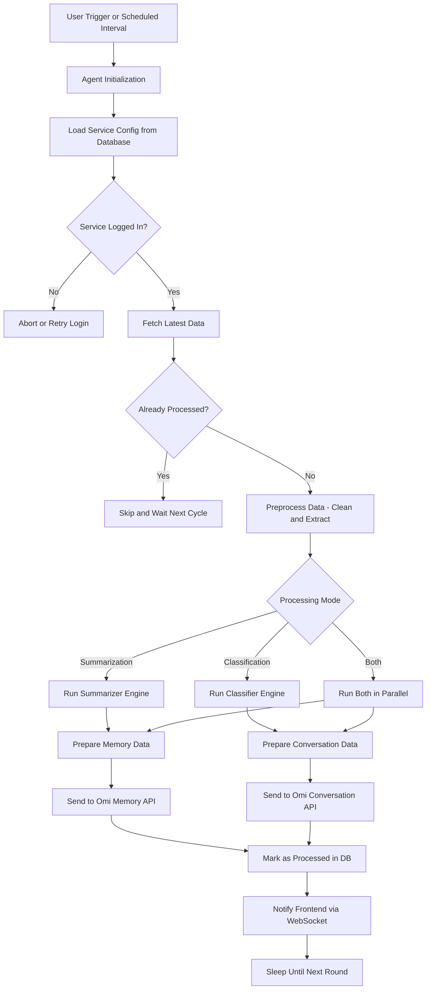

## 🧠 Agent Mate

Welcome to the **Agent Mate** — a fully modular, intelligent, and scalable framework designed to connect real-world data sources with your AI assistant.

AgentMate is a flexible, extensible framework for building AI-powered agents that can automate tasks and interact with various services.

In a world where digital information is scattered across emails, notes, calendars, and chat platforms, this system acts as a **unified brain**, continuously feeding Omi with **summarized insights**, **classified signals**, and **personal context**.

---

## Overview

AgentMate provides a robust foundation for creating intelligent agents that can:

- Process emails and other communications
- Interact with external services (Gmail, Calendar, etc.)
- Execute tasks based on natural language instructions
- Maintain context and memory across interactions
- Scale to handle multiple users and services

The framework is designed to be modular, allowing you to easily add new agents, subscribers, and integrations.

## Architecture

AgentMate is built with a clean, modular architecture:

### Core Components

- **Dependency Injection System**: A flexible DI system that manages service dependencies
- **Configuration Management**: A unified configuration system with validation
- **Event Bus**: A message broker system supporting multiple backends
- **Plugin System**: A dynamic plugin architecture for agents and subscribers
- **Error Handling**: Standardized error handling and reporting

### Agents

Agents are the core entities that perform tasks for users. Each agent:

- Has a specific purpose (e.g., email processing, calendar management)
- Can be configured with user-specific settings
- Maintains its own state and lifecycle
- Can interact with external services
- Can communicate with other agents

### Subscribers

Subscribers listen for events and perform actions in response. They:

- Subscribe to specific event types
- Process events asynchronously
- Can have dependencies on other subscribers
- Can be prioritized for execution order

### AI Engines

AI engines provide natural language processing capabilities:

- Support for multiple LLM providers
- Batching and rate limiting
- Caching for efficiency
- Error handling and retries

---

### 🔧 What Makes It Special?

✅ **Multi-Agent Architecture**  
Each service (Gmail, Notion, Slack...) is handled by its own isolated agent. Agents work independently, scale horizontally, and can be hot-restarted individually.

✅ **Event-Driven & Async**  
Built on `asyncio` and Redis Pub/Sub, it can handle thousands of users in parallel, without bottlenecks.

✅ **Plug & Play AI Engine**  
OpenAI GPT-based summarizer and classifier engines, reusable across agents, with JSON schema enforced responses and tool-calling support.

✅ **WebSocket Feedback**  
Agents push real-time updates to the frontend — users are instantly informed when memories or conversations are created.

✅ **Dynamic Config**  
Each agent is user-configurable via API or UI — control frequency, filters, categories, and more.

---

## ⚡ What Can It Do?

| 🚀 Feature                           | Description |
|------------------------------------|-------------|
| 📥 Auto-fetch emails from Gmail    | Periodically checks for new emails |
| 🧠 Smart classification             | Detects importance, topic, urgency, sentiment |
| 📝 Auto-summarization               | Converts email content into 200-character personal insight |
| 📤 Sends data to Omi API           | Integrates with both `Memory` and `Conversation` endpoints |
| ⚙️ Configurable via UI             | Each user sets interval, source, filters etc. |
| 📡 WebSocket-based feedback         | Real-time updates to the frontend after processing |

---

## 🧠 Why Is It Powerful?

### ✅ Modular Architecture
Each external source (Gmail, Notion, Calendar, etc.) is handled by a separate, pluggable **Agent**.

### 🧠 AI-Powered Engine
Powered by **OpenAI GPT-4**, our engine:
- Classifies content
- Summarizes meaning
- Tags intent
- Suggests actions

### 🔄 Event-Driven Processing
Everything works through **Redis Pub/Sub**:
- `gmail.inbox.classify` → run classification
- `gmail.inbox.summary` → run summarization

### ⚡ Performance Optimized
- `asyncio + thread pool` = fast concurrent execution
- Emails processed in **parallel batch tasks**
- Memory-safe processing with duplication prevention

---

## 🤖 Agent Examples

Build any of the following agents in minutes:

| Agent Type             | What It Does |
|------------------------|--------------|
| ✅ `GmailAgent`        | Connects to Gmail and fetches emails |
| 🔜 `NotionAgent`       | Pulls content from Notion pages |
| 🔜 `CalendarAgent`     | Extracts upcoming events |
| 🔜 `SlackAgent`        | Analyzes Slack messages |
| 🔜 `WebScraperAgent`   | Scrapes websites for relevant updates |

Agents implement the common `IAgent` interface and are registered via `AgentFactory`.

---

## 🔁 System Flow



## 🌐 Full API Reference

### 🧾 User Settings

| Method | Endpoint                                   | Description                     |
|--------|--------------------------------------------|---------------------------------|
| `POST` | `/settings/`                               | Create or update service config |
| `GET`  | `/settings/{uid}/{service_name}`           | Get current config for service  |

---

### 🤖 Agents

| Method | Endpoint         | Description               |
|--------|------------------|---------------------------|
| `GET`  | `/agent/status`  | List user’s active agents |

---

### 🔐 Unified Auth

| Method | Endpoint                     | Description                        |
|--------|------------------------------|------------------------------------|
| `GET`  | `/{service}/is-logged-in`    | Check if user is logged in         |
| `POST` | `/{service}/login-directly`  | Programmatic login (token-based)   |
| `POST` | `/{service}/logout`          | Logout from the service            |
| `GET`  | `/{service}/login`           | Start OAuth login flow             |
| `GET`  | `/{service}/callback`        | OAuth callback handler             |

---

### 🔧 Unified Service Webhook

| Method | Endpoint                          | Description                              |
|--------|-----------------------------------|------------------------------------------|
| `GET`  | `/{service}/get-settings`         | Get default or saved config              |
| `POST` | `/{service}/update-settings`      | Update config and restart agent          |
| `GET`  | `/setup-complete`                 | Check if user completed initial setup    |

### ✉️ Gmail Webhook
| Method | Endpoint                          | Description                              |
|--------|-----------------------------------|------------------------------------------|
| `GET`  | `/gmail/get-email-subjects`       | List recent email subjects (paginated)   |
| `POST` | `/gmail/convert-to-memory`        | Convert selected emails to Omi memories  |


> 💡 **Note:** All `{service}` parameters support dynamic values such as `gmail`, `notion`, `calendar`, etc.  
> The system automatically resolves the correct agent & handler for each.

---

## Getting Started

### Prerequisites

- Python 3.9+
- Redis (for event bus)
- PostgreSQL (for data storage)

### Installation

1. Clone the repository:
   ```
   git clone https://github.com/yourusername/AgentMate.git
   cd AgentMate
   ```

2. Create a virtual environment:
   ```
   python -m venv .venv
   source .venv/bin/activate  # On Windows: .venv\Scripts\activate
   ```

3. Install dependencies:
   ```
   pip install -r requirements.txt
   ```

4. Copy the environment template:
   ```
   cp .env.template .env
   ```

5. Edit the `.env` file with your configuration settings.

### Running the Application

Start the application:

```
python main.py
```

## Development

### Project Structure

```
AgentMate/
├── Agents/                # Agent implementations
├── Core/                  # Core framework components
│   ├── EventBus/          # Event bus implementation
│   ├── Models/            # Domain models and DTOs
│   └── ...
├── DB/                    # Database models and services
├── Engines/               # AI engines and processing
├── Interfaces/            # Interface definitions
├── Subscribers/           # Event subscribers
└── ...
```

### Creating a New Agent

1. Create a new class that inherits from `IAgent`
2. Implement the required methods
3. Register the agent with the plugin system

Example:

```python
from Interfaces.agent_interface import IAgent, AgentLifecycleState

class MyAgent(IAgent):
    # Define agent version and dependencies
    VERSION = AgentVersion(1, 0, 0)
    DEPENDENCIES = ["some_other_agent"]
    
    # Define configuration schema
    CONFIG_SCHEMA = {
        "setting1": {"type": "string", "required": True},
        "setting2": {"type": "integer", "default": 42}
    }
    
    async def _initialize_impl(self) -> bool:
        # Initialize agent-specific components
        return True
        
    async def _run_impl(self) -> bool:
        # Implement agent-specific processing
        return True
        
    async def _stop_impl(self) -> bool:
        # Clean up agent-specific resources
        return True
```

### Creating a New Subscriber

1. Create a new class that inherits from `BaseSubscriber`
2. Implement the required methods
3. Register the subscriber with the plugin system

Example:

```python
from Subscribers.base_subscriber import BaseSubscriber
from Core.EventBus import EventBus

class MySubscriber(BaseSubscriber):
    async def setup(self, event_bus: EventBus, **services):
        # Subscribe to events
        event_bus.subscribe("some_event", self.handle_event)
        
    async def handle_event(self, data):
        # Process the event
        pass
        
    async def stop(self):
        # Clean up resources
        pass
```

## License

This project is licensed under the MIT License - see the LICENSE file for details.
