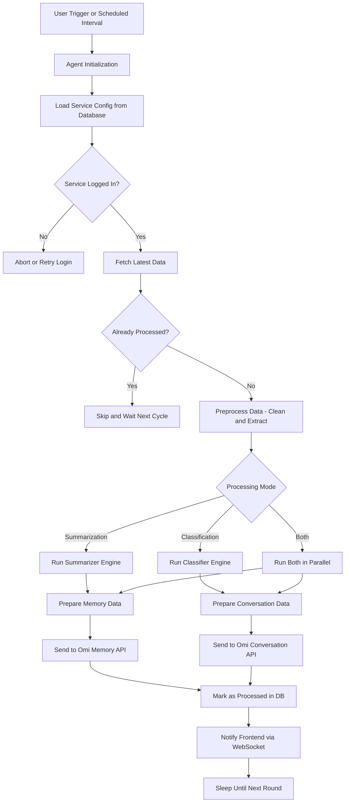

## 🧠 Agent Mate

Welcome to the **Agent Mate** — a fully modular, intelligent, and scalable framework designed to connect real-world data sources with your AI assistant.

In a world where digital information is scattered across emails, notes, calendars, and chat platforms, this system acts as a **unified brain**, continuously feeding Omi with **summarized insights**, **classified signals**, and **personal context**.

---

### 🎯 What Problem Does It Solve?

Most users have valuable information trapped inside:

- 📩 Emails (important discussions, decisions, deadlines)
- 📆 Calendar events (meetings, milestones)
- 🗒️ Notes (ideas, plans, knowledge)
- 💬 Messages (feedback, announcements, insights)

But these are **raw** — not useful to an AI out of the box.

This system:

- 🧠 Understands and filters your raw digital content
- ✂️ Summarizes, classifies, tags, and ranks it
- 🤖 Sends it to Omi as **Memory** or **Conversation**
- ⚡ Runs in the background, continuously and intelligently

---

### 🔧 What Makes It Special?

✅ **Multi-Agent Architecture**  
Each service (Gmail, Notion, Slack...) is handled by its own isolated agent. Agents work independently, scale horizontally, and can be hot-restarted individually.

✅ **Event-Driven & Async**  
Built on `asyncio` and Redis Pub/Sub, it can handle thousands of users in parallel, without bottlenecks.

✅ **Plug & Play AI Engine**  
OpenAI GPT-based summarizer and classifier engines, reusable across agents, with JSON schema enforced responses and tool-calling support.

✅ **WebSocket Feedback**  
Agents push real-time updates to the frontend — users are instantly informed when memories or conversations are created.

✅ **Dynamic Config**  
Each agent is user-configurable via API or UI — control frequency, filters, categories, and more.

---

## ⚡ What Can It Do?

| 🚀 Feature                           | Description |
|------------------------------------|-------------|
| 📥 Auto-fetch emails from Gmail    | Periodically checks for new emails |
| 🧠 Smart classification             | Detects importance, topic, urgency, sentiment |
| 📝 Auto-summarization               | Converts email content into 200-character personal insight |
| 📤 Sends data to Omi API           | Integrates with both `Memory` and `Conversation` endpoints |
| ⚙️ Configurable via UI             | Each user sets interval, source, filters etc. |
| 📡 WebSocket-based feedback         | Real-time updates to the frontend after processing |

---

## 🧠 Why Is It Powerful?

### ✅ Modular Architecture
Each external source (Gmail, Notion, Calendar, etc.) is handled by a separate, pluggable **Agent**.

### 🧠 AI-Powered Engine
Powered by **OpenAI GPT-4**, our engine:
- Classifies content
- Summarizes meaning
- Tags intent
- Suggests actions

### 🔄 Event-Driven Processing
Everything works through **Redis Pub/Sub**:
- `gmail.inbox.classify` → run classification
- `gmail.inbox.summary` → run summarization

### ⚡ Performance Optimized
- `asyncio + thread pool` = fast concurrent execution
- Emails processed in **parallel batch tasks**
- Memory-safe processing with duplication prevention

---

## 🤖 Agent Examples

Build any of the following agents in minutes:

| Agent Type             | What It Does |
|------------------------|--------------|
| ✅ `GmailAgent`        | Connects to Gmail and fetches emails |
| 🔜 `NotionAgent`       | Pulls content from Notion pages |
| 🔜 `CalendarAgent`     | Extracts upcoming events |
| 🔜 `SlackAgent`        | Analyzes Slack messages |
| 🔜 `WebScraperAgent`   | Scrapes websites for relevant updates |

Agents implement the common `IAgent` interface and are registered via `AgentFactory`.

---

## 🔁 System Flow

## 🌐 Full API Reference

### 🧾 User Settings

| Method | Endpoint                                   | Description                     |
|--------|--------------------------------------------|---------------------------------|
| `POST` | `/settings/`                               | Create or update service config |
| `GET`  | `/settings/{uid}/{service_name}`           | Get current config for service  |

---

### 🤖 Agents

| Method | Endpoint         | Description               |
|--------|------------------|---------------------------|
| `GET`  | `/agent/status`  | List user’s active agents |

---

### 🔐 Unified Auth

| Method | Endpoint                     | Description                        |
|--------|------------------------------|------------------------------------|
| `GET`  | `/{service}/is-logged-in`    | Check if user is logged in         |
| `POST` | `/{service}/login-directly`  | Programmatic login (token-based)   |
| `POST` | `/{service}/logout`          | Logout from the service            |
| `GET`  | `/{service}/login`           | Start OAuth login flow             |
| `GET`  | `/{service}/callback`        | OAuth callback handler             |

---

### 🔧 Unified Service Webhook

| Method | Endpoint                          | Description                              |
|--------|-----------------------------------|------------------------------------------|
| `GET`  | `/{service}/get-settings`         | Get default or saved config              |
| `POST` | `/{service}/update-settings`      | Update config and restart agent          |
| `GET`  | `/setup-complete`                 | Check if user completed initial setup    |

### ✉️ Gmail Webhook
| Method | Endpoint                          | Description                              |
|--------|-----------------------------------|------------------------------------------|
| `GET`  | `/gmail/get-email-subjects`       | List recent email subjects (paginated)   |
| `POST` | `/gmail/convert-to-memory`        | Convert selected emails to Omi memories  |

---

> 💡 **Note:** All `{service}` parameters support dynamic values such as `gmail`, `notion`, `calendar`, etc.  
> The system automatically resolves the correct agent & handler for each.

---

## 🧠 How to Add a New Agent

1. Create a class implementing `IAgent` interface
2. Register it: `AgentFactory.register("myagent", MyAgent)`
3. Optionally: Add `Subscriber` to listen for events
4. Add UI support if needed

That’s it — plug-and-play!

---

## 📦 Summary

✅ Directly integrates with **Omi API**  
✅ Fully **async**, **modular**, and **event-driven**  
✅ AI-powered insights from Gmail (and more!)  
✅ Real-time user feedback via **WebSocket**  
✅ Easy to expand for new services

> 💬 “Not just email parsing. This is memory engineering for your personal AI.”
